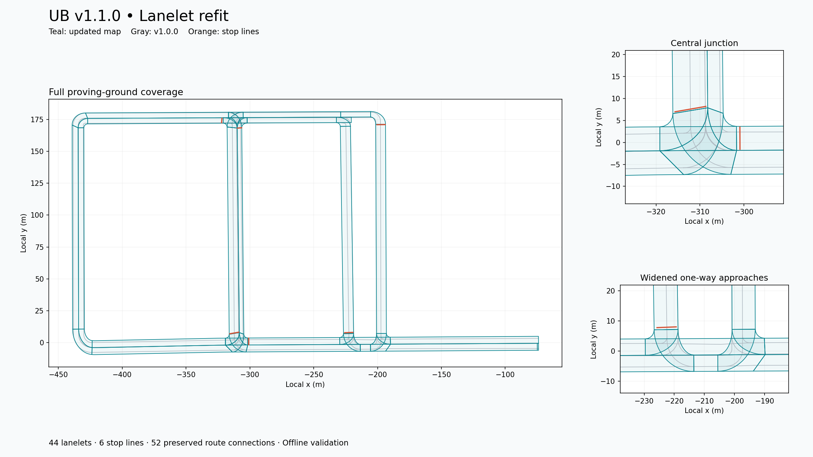

# UB v1.1.0 Lanelet refit

`lanelet2_map.osm` restores the full v1.0.0 proving-ground coverage using the
v1.1.0 OpenDRIVE lane widths. The previously installed v1.1.0 map covered only
14 lanelets around a T-junction; this map has 44 lanelets, six traffic-sign
regulations/stop lines, and all 52 original successor connections.



## Geometry and retained behavior

- Straight boundaries match same-direction CARLA lanes sampled from the
  v1.1.0 `UBAutonomousProvingGrounds.xodr`, including varying widths along roads.
  Examples: horizontal lanes about 5.461 m; north/south one-way sections about
  7.708 m and 7.952 m. Only driving lanes are used, excluding shoulders/sidewalks.
- Junction turns use tangent cubic curves. Shared junction cross-sections move
  along the approaches where widening would otherwise fold an inside corner.
- Boundaries are sampled at no more than 1 m. Endpoint IDs, relation IDs,
  memberships, speed limits, travel directions, and traffic-sign types remain
  those of v1.0.0. Stop lines/sign geometry move with their associated lanes.
- Coordinates remain Autoware `local_x`/`local_y`, with `projector_type: Local`.
  Numeric WGS84 coordinates derived from the OpenDRIVE georeference are also
  included for upstream Lanelet2 tools. The flat map's elevations are retained.

The turns retain the manually authored routes rather than importing every
OpenDRIVE junction movement. This is a geometric refit, not a survey or a full
OpenDRIVE conversion. Parking aisles and other roads outside the original
Lanelet coverage are not added.

## Validation and limits

`validation.json` records successful checks for all 44 polygons, centerlines
inside their lanelets, six stop lines, unchanged relation tags/memberships,
unchanged routing edges, successful Lanelet2 loading, and valid routing graphs.
Minimum left/right boundary separation is about 3.408 m. The map's existing
entry (260) and exits (261, 16796) are retained.

`native-validation.txt` reports zero issues for upstream mandatory tags,
boolean/tag values, duplicated points within linestrings, boundary curvature,
and routing validity. The **full upstream linter is not warning-free**:
`native-validation-summary.json` records unrecognized Autoware extension tags
and nearby points, including separately represented overlapping dividers in
the retained map topology. These checks were not suppressed in the summary.

No CARLA/Autoware drive was performed. Inspect the map against the v1.1.0
point cloud in RViz and test turns before treating it as a driving-validated
release. Turn boundaries are synthesized; an additional approximate comparison
with sampled OpenDRIVE driving-lane surfaces found the largest boundary
differences at the northwest corner (lanelets 4599/13459/4551, around 1.2 m
before a 0.2 m sampling tolerance). Those surfaces do not establish the full
paved junction area. Check that corner against the rendered road/point cloud.
The existing point cloud and projector configuration are not regenerated.

## Reproduce

Run from the repository root with Python 3.10, the CARLA 0.9.16 Python API,
NumPy, SciPy, pyproj, Lanelet2 Python bindings, Shapely, and Matplotlib installed.
Source the ROS environment to expose the Lanelet2 bindings. Source file hashes
and per-lane OpenDRIVE matches are in `lanelet2_map.refit.json`.

```bash
/usr/bin/python3 Map-Reconstruction/lanelet/refit_lanelet.py \
  --source Autoware/host_data/maps/ub_autonomous_proving_grounds/v1.0.0/lanelet2_map.osm \
  --opendrive CARLA/Builds/v1.1.0/CarlaUE4/Content/Carla/Maps/OpenDrive/UBAutonomousProvingGrounds.xodr \
  --output Autoware/maps/ub_autonomous_proving_grounds/v1.1.0/lanelet2_map.osm

/usr/bin/python3 Map-Reconstruction/lanelet/validate_lanelet.py \
  --source Autoware/host_data/maps/ub_autonomous_proving_grounds/v1.0.0/lanelet2_map.osm \
  --candidate Autoware/maps/ub_autonomous_proving_grounds/v1.1.0/lanelet2_map.osm \
  --opendrive CARLA/Builds/v1.1.0/CarlaUE4/Content/Carla/Maps/OpenDrive/UBAutonomousProvingGrounds.xodr \
  --report Autoware/maps/ub_autonomous_proving_grounds/v1.1.0/validation.json
```

Upstream rules used for routing comparison are Germany/Vehicle because that is
the available Lanelet2 rule set; identical rules are applied to both versions.
This verifies retained graph connectivity, not jurisdiction-specific behavior.
See [Lanelet2 validation documentation](https://docs.ros.org/en/jazzy/p/lanelet2_validation/__README.html)
and [Autoware's format extensions](https://github.com/autowarefoundation/autoware_lanelet2_extension/blob/main/autoware_lanelet2_extension/docs/lanelet2_format_extension.md).

## Local installation

The generated map is copied to
`Autoware/host_data/maps/ub_autonomous_proving_grounds/v1.1.0/lanelet2_map.osm`.
The previous map is retained beside it under
`.backups/lanelet2_map.pre-refit-687cd18d.osm`. Restart map loading to use the new
file. `installation.json` records paths and hashes for this local replacement.
The v1.0.0 map remains unchanged.
