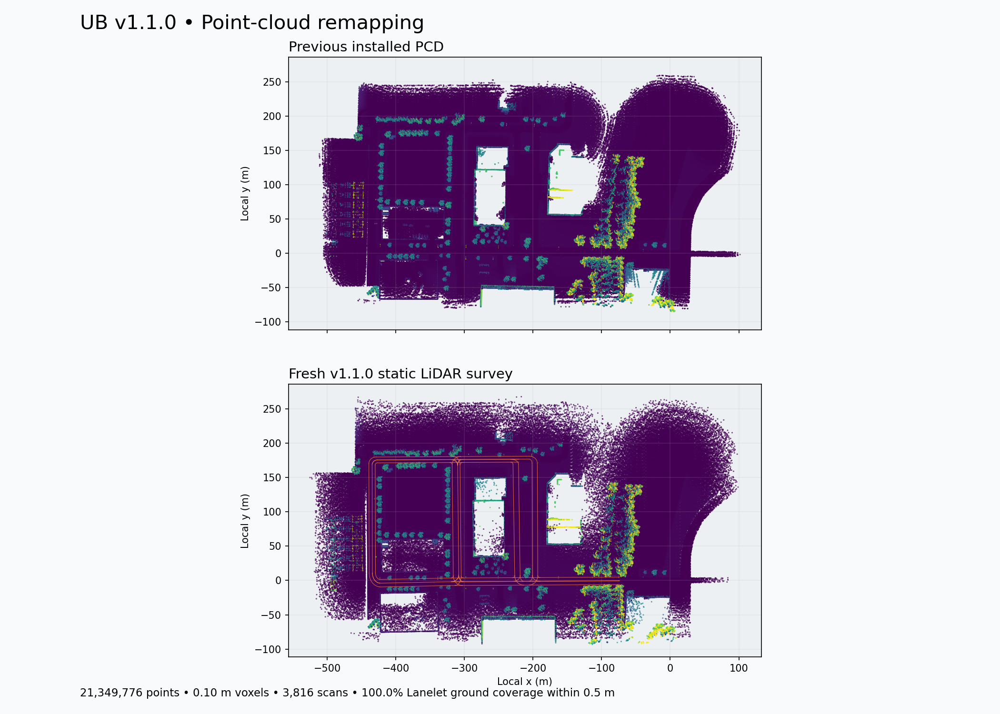

# v1.1.0 point-cloud remapping

A fresh static semantic-LiDAR survey of the installed CARLA v1.1.0 build.
The running server's OpenDRIVE was compared with the release OpenDRIVE before
capture. This point cloud is generated from the rendered world's collision
geometry, not by warping or reusing the previous cloud.

Result: **21,349,776 points**, 10 cm voxels, 1,908 stations and 3,816 full-rotation
scans. All 2,414 sampled Lanelet center points have ground returns within 0.168 m;
all survey stations have ground returns within 0.251 m. Format, finite-value,
voxel-uniqueness, checksum, and coverage checks pass. The previous PCD contained
9,363,908 points and is preserved in `.backups/pointcloud_map.pre-remap-8f157567.pcd`.

The installed output is:

`Autoware/host_data/maps/ub_autonomous_proving_grounds/v1.1.0/pointcloud_map.pcd`

`installation.json` records its SHA-256 and the previous cloud's backup path.
`capture.json` records source hashes, sensor configuration, scan counts,
semantic filtering, point counts, bounds, and timing. `survey_poses.csv` records
every scan station in Autoware local coordinates; lanelet ID 0 denotes an
additional station from an OpenDRIVE road.



## Survey method

- Sample all 44 updated Lanelets at approximately 3 m intervals, then add
  driving-lane stations in local bounds x=[-445,12], y=[-8,183] m. This covers
  the proving-ground routes and surrounding roads/parking aisles that provide
  context in the previous PCD. It does not map the entire campus.
- Place a stationary 128-channel semantic LiDAR 3.1 m above each road station,
  with a 90 m range and vertical field of view from -40 to +20 degrees.
- Capture two full 360-degree rotations per station, with a small pitch/yaw
  offset for the second scan to improve sampling between rings.
- Use acknowledged sensor transforms, frame-matched callbacks, and each
  measurement's recorded transform. Transitional scans are rejected if their
  pose differs from the requested station.
- Filter CARLA labels for pedestrians, riders, cars, trucks, buses, trains,
  motorcycles, bicycles, and dynamic objects. Retain static geometry and
  unclassified map geometry.
- Keep one actual static return per 10 cm voxel. Scans merge incrementally;
  there is no centroid smoothing, XY recentering, or registration drift.
- Convert CARLA world coordinates to Autoware Local with y=-CARLA_y. Keep x/z
  unchanged and leave the Lanelet and `map_projector_info.yaml` unchanged.
- Write uncompressed binary PCD with float32 x, y, z, intensity fields.
  The semantic sensor has no reflectance intensity; the intensity field uses
  synthetic `exp(-0.004 * range_m)`, matching CARLA RayCastLidar's default range
  attenuation model. It is not measured/calibrated material reflectivity.

## Checks and use

`validation.json` checks the PCD header/payload, finite values, intensity range,
unique voxels, source/output hashes, complete scan count, and nearby ground
returns along the Lanelet network. The comparison image shows heights from
0 to 10 m in purple through yellow, with Lanelet boundaries in orange.

The dedicated mapping server is stopped after capture. The installed PCD is
ready for the next map load; **restart Autoware/map loading** if it already has
the old cloud loaded. An end-to-end Autoware NDT localization drive has not
been performed. This is a simulated static map, not a physical LiDAR survey.

## Reproduce

Dependencies: Python 3.10, matching CARLA Python API, NumPy; validation also
needs SciPy and Matplotlib. Run from the repository root. Start a dedicated
CARLA v1.1.0 instance on port 2100, separate from the driving simulation:

```bash
CARLA/Builds/v1.1.0/CarlaUE4/Binaries/Linux/CarlaUE4-Linux-Shipping \
  CarlaUE4 -carla-rpc-port=2100 -RenderOffScreen -quality-level=Low -nosound -unattended
```

In another terminal, choose an unused output directory:

```bash
/usr/bin/python3 Map-Reconstruction/pointcloud/remap_carla.py \
  --lanelet Autoware/host_data/maps/ub_autonomous_proving_grounds/v1.1.0/lanelet2_map.osm \
  --opendrive CARLA/Builds/v1.1.0/CarlaUE4/Content/Carla/Maps/OpenDrive/UBAutonomousProvingGrounds.xodr \
  --road-bounds -445 -8 12 183 \
  --output-dir /tmp/ub-pcd-new-survey

/usr/bin/python3 Map-Reconstruction/pointcloud/validate_pcd.py \
  --candidate /tmp/ub-pcd-new-survey/pointcloud_map.pcd \
  --previous Autoware/host_data/maps/ub_autonomous_proving_grounds/v1.1.0/pointcloud_map.pcd \
  --lanelet Autoware/host_data/maps/ub_autonomous_proving_grounds/v1.1.0/lanelet2_map.osm \
  --capture /tmp/ub-pcd-new-survey/capture.json \
  --report-dir /tmp/ub-pcd-new-survey/review
```

The collector loads the UB map using its advertised server name, restores
world settings and destroys its sensor afterward. It refuses to overwrite
an existing output PCD or run on a server containing vehicles/walkers/sensors.
It does not install its output automatically.

Run focused collector tests with:

```bash
/usr/bin/python3 -m unittest discover -s Map-Reconstruction/tests -p test_remap_carla.py -v
```
