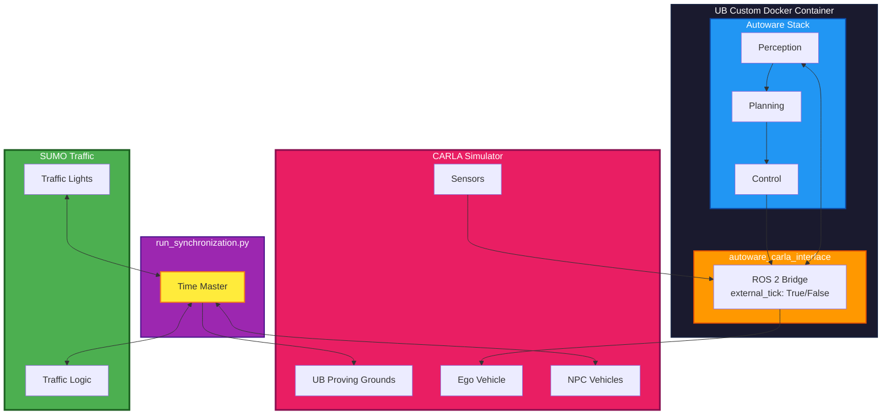

# Custom Digital Twin Project for UB

A high-fidelity **Digital Twin** environment for the University at Buffalo (UB) Autonomous Proving Grounds, integrating **CARLA**, **SUMO**, and **Autoware**.

> ⚠️ **Prerequisite**: Run within [UB's Custom Docker Container](docs/setup.md#docker-container)

---

## Quick Start

```bash
# 1. Install dependencies in Autoware docker container
./ini_setup.sh

# 2. Start CARLA on host
./CarlaUE4.sh -quality-level=Low/Medium/High/Epic -prefernvidia

# 3. Launch Autoware
ros2 launch autoware_launch e2e_simulator.launch.xml \
    map_path:=/host_data/<PATH_TO_UB_AUTOWARE_MAP> \
    vehicle_model:=sample_vehicle \
    sensor_model:=awsim_sensor_kit \
    simulator_type:=carla \
    carla_map:=UBAutonomousProvingGrounds
```

📋 [Full Command Cheat Sheet](docs/COMMANDS.md)

---

## System Architecture



---

## 📁 Project Structure

```
├── autoware_carla_interface/   # ROS 2 bridge package
├── Sumo/                       # SUMO integration & configs
├── custom/                     # Custom maps and scripts
├── docs/                       # Documentation
│   ├── setup.md               # Installation guide
│   ├── carla-autoware.md      # CARLA + Autoware guide
│   ├── carla-sumo.md          # CARLA + SUMO guide
│   ├── combined-setup.md      # Full system guide
│   └── COMMANDS.md            # Command cheat sheet
└── ini_setup.sh               # Dependency installer
```

---

## Requirements

| Component | Version |
|-----------|---------|
| CARLA | 0.9.15 / 0.9.16 |
| ROS 2 | Humble / Galactic |
| SUMO | Latest |
| Python | 3.8+ |

[📖 Full Setup Guide](docs/setup.md)

---

## Documentation

| Document | Description |
|----------|-------------|
| [Setup Guide](docs/setup.md) | Installation & configuration |
| [CARLA + Autoware](docs/carla-autoware.md) | AV testing mode |
| [CARLA + SUMO](docs/carla-sumo.md) | Traffic simulation mode |
| [Combined Setup (SUMO + Autoware + Carla)](docs/combined-setup.md) | Full digital twin |
| [Commands](docs/COMMANDS.md) | Quick reference cheat sheet |

---

## Why Use This?

- **Realistic Simulation** - CARLA's physics + SUMO's traffic
- **Safe Testing** - Validate algorithms before real-world deployment  
- **Scalability** - Simulate edge cases impossible in reality
- **UB Custom Map** - Tailored for the Autonomous Proving Grounds

---
