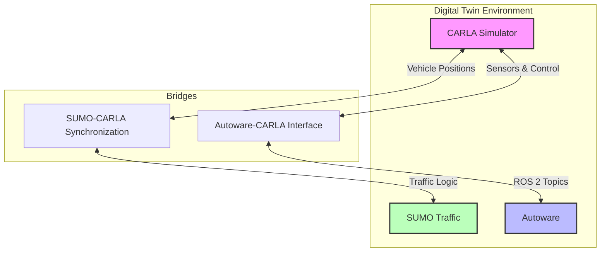

# Custom Digital Twin Project for UB

This project establishes a high-fidelity **Digital Twin** environment for the University at Buffalo (UB) Autonomous Proving Grounds. By integrating **CARLA** (for photorealistic rendering and sensor simulation), **SUMO** (for realistic traffic flow and behavior), and **Autoware** (for the autonomous driving stack), this system enables comprehensive testing and validation of autonomous vehicle algorithms.

**IMPORTANT PREREQUISITE**: This setup is designed and tested to run within **UB's Custom Docker Container**. Please ensure you have set up and launched the Docker container before proceeding.

## Why use this?

* **Realistic Simulation**: Combines CARLA's physics and sensor fidelity with SUMO's complex traffic scenarios.
* **Safe Testing**: Allows for rigorous testing of Autoware's planning and control algorithms in a virtual UB environment before deployment on physical vehicles.
* **Scalability**: Facilitates the simulation of various traffic densities and edge cases that are difficult or dangerous to recreate in the real world.

## 1. Project Structure & Requirements

### System Architecture

The system consists of three main components connected via bridges:

1. **CARLA Simulator**: Provides the environment, sensors, and vehicle physics.
2. **SUMO**: Manages traffic logic and background vehicles.
3. **Autoware**: The autonomous driving software stack.

**Connections**:

* **CARLA <-> Autoware**: Connected via the `autoware_carla_interface` (ROS 2 topics for sensors/control).
* **CARLA <-> SUMO**: Connected via `run_synchronization.py` (syncs vehicle positions and traffic lights).



### Structure

* **`Sumo/`**: Contains scripts and configuration files for SUMO integration, including the synchronization loop (`run_synchronization.py`).
* **`autoware_carla_interface/`**: A ROS 2 package that acts as a bridge between Autoware and CARLA.
* **`custom/`**: Stores custom maps and assets.
* **`ini_setup.sh`**: A helper script to install necessary Python dependencies.

### Requirements

* **CARLA**: Version 0.9.15 or 0.9.16.
* **ROS 2**: Humble or Galactic.
* **SUMO**: Latest version compatible with your system.
* **Python Dependencies**: Install using the provided script.

### Setup

1. **Install Dependencies**:

    ```bash
    ./ini_setup.sh
    ```

2. **Environment Variables**:
    Ensure `HOST_DATA_PATH`, `AUTOWARE_DATA_PATH`, and `PYTHONPATH` are correctly set for your environment.

---

## 2. Running Instructions

### 2a. Running CARLA and Autoware Together

**Goal**: Run Autoware with CARLA as the simulator.

#### 1. Prerequisites

This setup relies on the Python API to communicate with CARLA. Ensure the following are set up:

* **Virtual Environment**: Recommended for isolation (e.g., `venv` or `conda`).
* **Dependencies**: Run the helper script to install the required packages (`carla==0.9.16`, `transforms3d`).

    ```bash
    ./ini_setup.sh
    ```

#### 2. Architecture & Time Control

In this configuration, the `autoware_carla_interface` acts as a bridge, converting CARLA sensor data to ROS 2 topics and Autoware commands to CARLA vehicle controls.

* **Time Master**: The **Interface** acts as the "Ticker". It triggers each simulation step in CARLA and publishes the simulation time to ROS 2 (`/clock`), ensuring synchronization.

#### 3. Execution Steps

**Step 1: Launch CARLA**
Start the simulator in server mode.

```bash
./CarlaUE4.sh -quality-level=Epic
```

**Step 2: Verify Interface (Optional)**
Run this to confirm the bridge connects and loads the map.
**NOTE**: `external_tick:=False` is used so the interface drives the simulation time.

```bash
ros2 launch autoware_carla_interface autoware_carla_interface.launch.xml carla_map:=Town01 external_tick:=False
```

> **Verification**: Check for ROS 2 topics (`ros2 topic list`).
> **IMPORTANT**: **Terminate this process (Ctrl+C)** after verification to avoid conflicts with Step 3.

**Step 3: Launch Autoware**
Start the full Autoware stack with the custom map and vehicle configuration.

```bash
ros2 launch autoware_launch e2e_simulator.launch.xml map_path:=/host_data/new_build_map vehicle_model:=sample_vehicle sensor_model:=awsim_sensor_kit simulator_type:=carla carla_map:=UBAutonomousProvingGrounds
```

### 2b. Running CARLA and SUMO Together

**Goal**: Run CARLA with SUMO traffic.

#### 1. Prerequisites

* **SUMO**: Ensure SUMO is installed and the `SUMO_HOME` environment variable is set.
* **Python Dependencies**: The synchronization script requires `carla` and `transforms3d`.

    ```bash
    ./ini_setup.sh
    ```

#### 2. Architecture & Time Control

This mode uses a co-simulation script to synchronize vehicles between CARLA and SUMO.

* **Time Master**: The **Synchronization Script** (`run_synchronization.py`) acts as the "Ticker". It advances the simulation step-by-step in both CARLA and SUMO, ensuring they remain in sync.

#### 3. Execution Steps

**Step 1: Launch CARLA**
Open CARLA with the desired map manually.

```bash
./CarlaUE4.sh 
```

```bash
python3 config.py --map UBAutonomousProvingGrounds
```

**Step 2: Run Synchronization**
Execute the Python script to start the co-simulation.

```bash
python3 Sumo/run_synchronization.py Sumo/examples/Town01.sumocfg
```

> **Note**: This script will spawn SUMO vehicles into CARLA and vice-versa. You should see traffic appearing in the CARLA window.
>
> **CRITICAL WARNING**: Ensure that the **same map** is loaded in CARLA (e.g., `Town01` or `UBAutonomousProvingGrounds`) and in the SUMO configuration file. Mismatched maps will cause the simulation to crash or throw errors.

### 2c. Running CARLA, Autoware, and SUMO (Combined)

**Goal**: Run all three systems together.

#### 1. Prerequisites

* **Dependencies**: Ensure all prerequisites from Sections 2a and 2b are met (Python packages, SUMO environment, Docker container).
* **Map Consistency**: **CRITICAL**: The same map must be used in CARLA, SUMO, and Autoware.

#### 2. Setup

**Step 1: Get Custom Packages**
Clone the GitHub repository containing the custom packages.

```bash
git clone <REPO_URL>
```

**Step 2: Setup SUMO**
Replace the default `Sumo` folder in your CARLA installation with the one from the cloned repository.

* **Source**: `cloned_repo/Sumo`
* **Destination**: `$CARLA_ROOT/Co-Simulation/Sumo`

**Step 3: Setup Autoware Interface (Docker)**
You need to replace the `autoware_carla_interface` package within the Autoware Docker container.

* **Option A (Recommended)**: Copy the modified package from the cloned repo to your shared host folder (defined by `$HOST_DATA_PATH`) so it's accessible inside the container.
* **Option B**: Clone the repository directly inside the container.

**Step 4: Replace Package in Autoware Workspace**
Inside the Docker container, replace the existing interface package:

1. Delete the existing package:

    ```bash
    rm -rf /autoware/src/universe/autoware_universe/simulator/autoware_carla_interface
    ```

2. Copy the modified `autoware_carla_interface` package from your source (Step 3) to this location.

**Step 5: Configure Launch File**
Edit the launch file to ensure the bridge runs in passive mode by default.

* **File**: `/autoware/src/universe/autoware_universe/simulator/autoware_carla_interface/launch/autoware_carla_interface.launch.xml`
* **Action**: Open the file and set the `external_tick` argument default value to `True`.

#### 3. Architecture & Time Control

In this combined mode, the systems must agree on who controls the simulation time.

* **Time Master**: The **SUMO Synchronization Script** (`run_synchronization.py`) acts as the "Ticker". It advances CARLA's time.
* **Passive Bridge**: The **Autoware Interface** runs in "passive mode" (`external_tick:=True`). It does *not* tick CARLA; it only bridges data.

#### 4. Execution Steps

**Step 1: Launch CARLA**
Start CARLA with the target map (e.g., `UBAutonomousProvingGrounds`).

```bash
./CarlaUE4.sh /Game/Carla/Maps/UBAutonomousProvingGrounds
```

**Step 2: Run Synchronization (The Ticker)**
Start the SUMO-CARLA bridge. This script will begin ticking the simulation.

```bash
python3 Sumo/run_synchronization.py Sumo/examples/UBAutonomousProvingGrounds.sumocfg
```

> **Verification**: You should see traffic in CARLA. The simulation time should be advancing.

**Step 3: Launch Interface (Passive Mode)**
Launch the ROS 2 bridge with `external_tick:=True`. This prevents the bridge from trying to tick CARLA, avoiding conflicts with the SUMO script.

```bash
ros2 launch autoware_carla_interface autoware_carla_interface.launch.xml carla_map:=UBAutonomousProvingGrounds external_tick:=True
```

> **Verification**: Check for ROS 2 topics. Ensure no "double tick" errors appear in the logs.

**Step 4: Launch Autoware**
Run your standard Autoware launch command.

```bash
ros2 launch autoware_launch e2e_simulator.launch.xml map_path:=/host_data/new_build_map vehicle_model:=sample_vehicle sensor_model:=awsim_sensor_kit simulator_type:=carla carla_map:=UBAutonomousProvingGrounds
```
