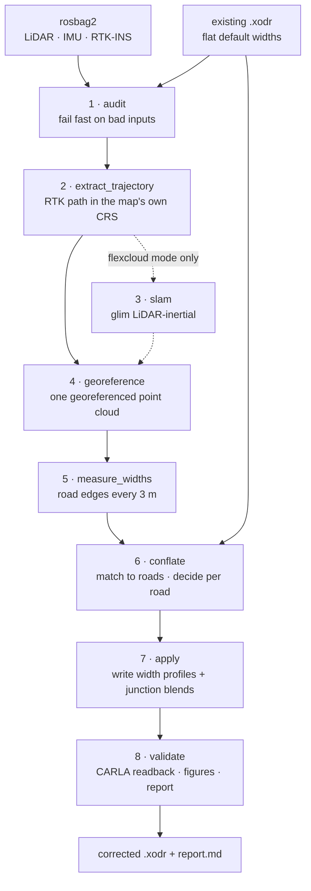

# The lanefit pipeline

How to run the pipeline one stage at a time, what each stage produces, how to check
it, and why each stage works the way it does. The [design notes](#design-notes) at the
end cover the reasoning; the stage sections link into them.

Legacy script names refer to `~/map_conflation/scripts/`, the validated reference
implementation, kept untouched.

Start at [`README.md`](../README.md) for the overview and a one-command run. See
[`SETUP.md`](SETUP.md) for what your data and your container have to provide.

Everything below runs **inside the tooling container** (`autoware_c`) unless noted.
From the host you can either prefix commands with `~/lanefit/bin/lanefit ...`, which
syncs the package and sources ROS for you, or enter the container yourself:

```bash
cd ~/ub-lincoln-docker/docker && ./dc_up.sh && ./dc_bash.sh
source /opt/ros/humble/setup.bash && source /host_data/ws/install/setup.bash
export PYTHONPATH=/host_data/lanefit
python3 -m lanefit stages
```

Conventions: `RUN=/host_data/lanefit_runs/<name>`, `BAG=<rosbag dir>`, `XODR=<map>`.
The first stage invocation records `--bag/--xodr` into `RUN/manifest.json`, and later
stages reuse them.

---

## The pipeline at a glance

Each stage writes its outputs into the run directory and records its status in
`manifest.json`. A re-run skips what is already done and picks up where you left off.



| stage | what it does | key output |
|---|---|---|
| `audit` | Health-checks the bag, the extrinsics and the map, then fails fast. | `audit/audit_report.md` |
| `extract_trajectory` | RTK-fixed epochs projected into the map's own `<geoReference>` CRS. | `gnss_trajectory.csv` |
| `slam` | glim LiDAR-inertial SLAM, QC'd against GNSS. Skipped in `ins_direct` mode. | `slam/dump/` |
| `georeference` | Builds the cloud, either by `ins_direct` RTK-INS projection (the default) or by `flexcloud` SLAM plus rubber-sheeting, for GNSS-denied data. | `georef_map_ins.pcd` |
| `measure_widths` | Ground extraction, painted-line tracking, dual-bound edge tracking. | `widths.csv` |
| `conflate` | Matches stations to roads, applies the evidence policy, builds width profiles. | `road_matches.csv` |
| `apply` | Writes the profiles onto the matched driving lanes, blends junction connectors. | `<map>_corrected.xodr` |
| `validate` | CARLA readback, seam continuity, figures, final report. | `validate/`, `report.md` |

---

## 0. (optional) trim parked periods from the bag

```bash
python3 -m lanefit trim-bag --bag $BAG --out-bag ${BAG}_driving
```
Detects stationary GNSS runs of `trim_bag.min_park` s or longer and cuts them, keeping
a 10 s stationary pre-roll for glim's IMU init along with all latched and one-shot
topics. Not required for correctness, since the measure stage
[dedupes stationary epochs anyway](#measurement), but SLAM runs faster without them.
*Legacy:* `split_rosbag_remove_parked.py`.

## 1. audit: know your inputs before burning CPU

```bash
python3 -m lanefit stage audit --out $RUN --bag $BAG --xodr $XODR
less $RUN/audit/audit_report.md
```
Checks that the tools are present and the topics exist, that the LiDAR has intensity
and a recognized per-point time field (it prints the semantics), the IMU rate and gaps
plus [NaN-axis decoy rejection](#the-sensor-rig), the RTK-fixed share, stationary and
parked intervals, `T_lidar_imu` derived from `/tf_static`, and the xodr geoReference,
censuses and **initial width histogram**, which is the "before" state of the map.
Anything the pipeline cannot survive fails here rather than an hour later.
*Legacy:* `inspect_bag.py`, `verify_quality.py`, `imu_gap_check.py`, ad-hoc greps.

## 2. extract_trajectory: RTK ground truth in map coordinates

```bash
python3 -m lanefit stage extract_trajectory --out $RUN
head -3 $RUN/extract_trajectory/gnss_trajectory.csv
```
Keeps only `pos_type=INS_RTKFIXED` and `ins_status=GOOD` epochs, then projects lat/lon
into the xodr `<geoReference>` CRS with pyproj. Heights are MSL, per the INSPVAX
convention. *Legacy:* `extract_gnss_trajectory.py`.

## 3. slam: glim LiDAR-inertial odometry and mapping

```bash
python3 -m lanefit stage slam --out $RUN          # smoke run + full pass + QC
tail -5 $RUN/slam/glim_full.log
```
Generates the glim config from `slam.base_config` by editing parsed JSON rather than
patching strings: your topics, the tf-derived `T_lidar_imu`, CPU modules, headless
mode, and the per-point-time settings. Leave `perpoint_time_scale` at 1.0, for
[the reason below](#the-sensor-rig). Runs a 15 s smoke pass, then the full bag, then QC
against GNSS with a 5 % path-length tolerance and a z-drift warning.
*Legacy:* `setup_glim_config.py` and `run_step2.sh` step 3.

## 4. georeference: into the map frame, intensity intact

Two methods, selected by `georeference.method`.

**`ins_direct`** is the default and the better choice whenever RTK is continuous. It
projects every raw scan with the 50 Hz INS pose interpolated at the point's own
timestamp, so there is no SLAM, no warp and no drift. It applies the per-rig
[boresight](#the-sensor-rig) rotation (`boresight_pitch_deg` and `boresight_roll_deg`),
converts INSPVA ellipsoidal height to MSL using the INSPVAX undulation, and filters
mirror-reflection ghosts via `range_max` and `below_traj_max`. The stage reports
`ground_thickness_cm`; expect under 10, and it warns above 25. The `slam` stage is
skipped automatically in this mode.

**`flexcloud`** is the fallback for GNSS-denied data.

```bash
python3 -m lanefit stage georeference --out $RUN
grep -A6 "Trajectory matching" $RUN/georeference/georeferencing.log
```
Merges glim submaps with their optimized poses, keeping intensity, at voxel size
`georeference.merge_voxel`. Writes FlexCloud inputs with stamps in **seconds** and
poses trimmed inside GNSS coverage, runs `keyframe_interpolation` and `georeferencing
--pcd --evaluation`, then parses the rubber-sheet RMSE and fails above
`georeference.max_rubber_rmse`. *Legacy:* `merge_glim_map.py`,
`make_flexcloud_inputs.py`, `run_step2.sh` steps 4-6.

## 5. measure_widths: the actual measurement

```bash
python3 -m lanefit stage measure_widths --out $RUN
xdg-open $RUN/measure_widths/width_profile.png   # host side
```
Takes a ground band around the trajectory-anchored road level, with stationary epochs
deduped first. Tracks painted lines as narrow, z-smooth intensity peaks chained across
sections with dash tolerance. Runs dual-bound DP edge tracking to produce `widths.csv`,
one row per 3 m station: inner and outer edges and widths, per-side confidence (2 for
multi-signal, 1 for single, 0 for carried), and marking positions. What the two bounds
mean, and why there are two, is [below](#measurement).
*Legacy:* `step3_explore2.py`, `step3_detect.py`, `step3_widths.py`, `step3_chart.py`.

## 6. conflate: measurements onto map lanes

```bash
python3 -m lanefit stage conflate --out $RUN
column -s, -t $RUN/conflate/road_matches.csv
```
Samples every normal road's reference line near the corridor (line and arc in closed
form, spirals via Fresnel) and matches stations to it within `conflate.match_dist`,
heading-parallel. Then, per road, the [evidence policy](#writing-the-map): enough
stations (`min_stations`), enough coverage of the road length (`min_coverage`), low
local scatter (`max_local_resid`), enough multi-signal stations (`min_conf2_share`),
and a per-lane value inside [`lane_min`, `lane_sane_max`]. Roads that pass get a
piecewise width profile, with knots every `knot_spacing` m, plus a `center_delta`
lateral registration. Roads that fail keep their ORIGINAL widths and are listed in
`skipped_roads.csv` with the reason. The lane split is symmetric, which makes it
immune to lane-sign errors. *Legacy:* `step4_match.py`.

## 7. apply: write the corrected map

```bash
python3 -m lanefit stage apply --out $RUN
ls -la $RUN/apply/
```
Replaces the `<width>` records of exactly the listed driving lanes with the piecewise
cubic profile, one record per knot segment, clipped to the laneSection. Adds the
`center_delta` shift to `<laneOffset>` so the lane stack sits on the measured
centerline. With `apply.taper_junctions` set, it also blends each junction connector
between its endpoint roads' widths using a cubic smoothstep and the nearest known
width. It refuses to touch any lane whose type is not `driving`, restores the
geoReference CDATA, and re-parses to verify. *Legacy:* `step5_write.py`.

The taper is what keeps a junction interface at the width its geometry was built for.
Each connector blends between its two neighbours instead of stepping:

```
 per-lane width
   3.2 ┤ ●───●───●───●╮                       ╭●───●───●───●
   3.0 ┤              ╰───── cubic blend ─────╯
   2.8 ┤                 no step at the seam
       └───────────────────────────────────────────────────────→ s
         road 12 · measured   connector       road 27 · measured
```

An endpoint that was never corrected inherits the other end's measured width, never
the map default. Set `apply.taper_junctions: false` to leave connectors untouched.

## 8. validate: prove it

```bash
python3 -m lanefit stage validate --out $RUN
less $RUN/report.md
```
Parses the result as a `carla.Map` and reads `waypoint.lane_width` back for every
corrected lane, skipping with a warning if the carla package is missing. Compares
before and after against the measured interval, walks the waypoint chain across every
seam to catch lane-center jumps, renders the figures, and writes the rollup report.
For the visual check, load `$RUN/apply/*_corrected.xodr` into a running CARLA; that
part needs a simulator. *Legacy:* ad-hoc carla_check and err_fig snippets, plus
`step6_roadmap_figure.py`.

## 9. (optional) combine several drives

```bash
python3 -m lanefit merge-runs --runs $RUN1,$RUN2 --xodr $XODR --out $MERGED
```
Each run needs a completed `conflate` stage. Per road, the run with the most matched
stations wins, with coverage as the tiebreak. Winner-takes-all beats pooling here
because drives can disagree systematically (seasonal snowbank narrowing, for one), and
mixing them would widen the scatter enough to reject roads that a single good drive
measured confidently. Every decision stays traceable to one run through the
`source_run` column. `apply` and `validate` then run automatically in the merged run
directory, so junction tapers see the union of all corrected roads.

---

## Tuning cheat-sheet

| symptom | knob |
|---|---|
| SLAM path length error > 5 % | check audit extrinsics, the IMU topic, and `slam.perpoint_time_scale` (leave it at 1.0 for uint32-ns fields) |
| georeference RMSE too high | `georeference.control_points` up; check the RTK share in the audit |
| widths hop between boundaries | `widths.jump_w` up, or bias toward the boundary you trust |
| too few corrected roads | read the reason in `skipped_roads.csv`, then `conflate.min_stations` / `min_coverage` down, `match_dist` up |
| lanes too narrow or wide in CARLA | `conflate.lane_min` / `lane_sane_max` bounds |
| parked-vehicle smear in the cloud | `trim-bag` first |

Every tunable is documented inline in [`config/default.yaml`](../config/default.yaml).

---

# Design notes

Why the pipeline is shaped the way it is. Nearly every item below is a real failure
found on the reference dataset, not a precaution. The code has the fix; this half of
the document has the reasoning, so nobody simplifies it back.

## Coordinate frames

**The map's CRS is authoritative.** The cloud is georeferenced into the exact
`<geoReference>` PROJ string of the input `.xodr`, which is often a local transverse
Mercator rather than UTM. Nothing gets re-projected afterwards, so there is no second
chance to introduce a datum error.

**Matching is XY-only.** OSM-derived maps carry zero elevation, so comparing z would
compare a measurement against a placeholder. The audit reports how many non-zero
elevation records the map has, so you find out before it matters.

## The sensor rig

**Boresight is not what the URDF claims.** `tf_static` rotations are trusted nowhere.
The reference rig needed **+4.2 degrees of pitch** where the URDF reported identity.
That single uncorrected error produced roughly 100 cm of apparent ground thickness and
was the root cause of fuzzy SLAM clouds. `ins_direct` carries a per-rig boresight
(`georeference.boresight_pitch_deg` and `_roll_deg`). Calibrate it by minimizing
multi-pass ground thickness, which bottomed out at 4 cm on the reference rig, and
**re-calibrate after any mount change**.

**Translations are derived, not hardcoded.** `T_lidar_imu` comes out of the bag's
`/tf_static` through the full quaternion chain, in the audit stage, so it cannot drift
out of sync with the recording it describes.

**Per-point time is already scaled.** glim's PointCloud2 converter divides a UINT32
`time_stamp` in nanoseconds by 1e9 itself. `slam.perpoint_time_scale` therefore has to
stay at 1.0. "Correcting" it to 1e-9 double-scales and silently breaks motion deskew,
with no error message and a subtly smeared map as the only symptom.

**Some IMU topics are decoys.** A CAN yaw-rate sensor can publish `sensor_msgs/Imu`
with perfectly steady timing and non-finite values on the axes it does not measure. On
every rate and gap metric it looks healthier than the real IMU. The audit rejects any
IMU topic with non-finite axes rather than letting SLAM consume it.

## Measurement

**Stationary epochs are deduplicated before the station frame is built.** Duplicated
GNSS positions produce zero-length tangents whose direction is pure noise, and that
scrambles the lateral `(s, t)` frame around every stop. Deduping first is why
`trim-bag` is an optimization rather than a correctness requirement.

**Ground is anchored to the trajectory, not fitted.** The road level comes from the RTK
height plus a data-estimated antenna offset, taken as the histogram mode of nearby
returns, and points are kept within a band around it. A plane fit would be dragged
around by parked cars, embankments and vegetation.

**Two bounds, because unpainted roads have no single edge.** A service road with no
paint has no one place you can call "the edge", so two get measured at every 3 m
station:

```
  grass │ shoulder ┊     traveled band (ego drives here)    ┊ shoulder │ grass
 ═══════╪══════════┊════════════════════●═══════════════════┊══════════╪═══════
        ↑          ↑                    ↑                   ↑          ↑
      outer      inner           ego path (RTK)           inner      outer

        ├───────────────────────── width_out ──────────────────────────┤
                   ├────────────── width_in ────────────────┤
```

`width_in`, the traveled band, comes from painted lines, weak intensity transitions and
low curbs. `width_out`, the pavement extent, comes from strong intensity transitions
and curb steps. The two are tracked separately by dynamic programming, with different
cost weights and opposite lateral biases. `conflate` uses the inner bound. The outer
one is the QC upper bound, drawn in the figures.

Each station also carries a confidence: 2 where multiple signals agreed, 1 for a single
signal, 0 where there was no local evidence and the position was carried from the
neighbour.

**The OUTER intensity threshold works here.** The legacy scripts used
`bright_factor = 99`, which made `max(99 x asphalt, asphalt + add)` unreachable, a
threshold around 495 on a 0-255 scale. Legacy OUTER was therefore driven by z-steps
alone. Here `bright_factor = 0` disables the factor term and the threshold is
`asphalt + 30`, the grass level, so the outer bound is what it claims to be. Final
picks were unaffected, because selection prefers the inner end, which is why this went
unnoticed for so long.

## Writing the map

**Trust or don't touch.** A road gets corrected only when its evidence passes five
independent criteria: station count, coverage of the road's length, local scatter
against a rolling median, share of multi-signal stations, and per-lane plausibility.
Everything weaker keeps its original width and gets reported in `skipped_roads.csv`
with the failing criterion named. A half-measured road is worse than an unmeasured one,
because it looks corrected.

Local scatter is the criterion worth understanding. Width genuinely varies *along* a
road, so global variation is signal rather than noise. Only deviation from the road's
own rolling-median profile counts as ambiguity.

**Profiles, not constants.** A corrected road gets a knot spline (roughly 9 m spacing,
monotone PCHIP slopes, flat ends) written as piecewise `<width>` cubics. Within a road
that passed, individual knots are still clipped to `[lane_min, lane_sane_max]`, because
a local excursion like an intersection throat or a pavement flare must not write a
sim-breaking value even when the road as a whole is trustworthy. Stations within
`end_margin` of a road's ends get dropped before profiling, since intersection throats
contaminate them and produce pinched mouths.

**Junction connectors are blended, not measured.** A connector inherits a cubic
smoothstep between its two endpoint roads' profile values. An endpoint with no
measurement inherits the other end's value, never the map default, which would put a
visible step at exactly the seam an NPC has to drive through.

**Lateral registration.** OSM reference lines sit off to one side of the real
carriageway, so widening lanes around the original centerline puts the road in the
wrong place. A corrected road's whole lane stack gets shifted onto the measured
centerline via `<laneOffset>`, and the shift is blended through the connectors
alongside the widths.

**The writer is surgical.** It touches only `driving` lanes on evidence-backed roads
and refuses outright to modify a lane of any other type. It restores the
`<geoReference>` CDATA wrapper that ElementTree escapes away, and re-parses the output
to verify every value it wrote. Junction roads, low-coverage roads and non-driving
lanes keep their original records byte for byte.

## Tooling

**Pinned source builds, not the PPA.** The upstream koide3 apt repository is internally
inconsistent: its prebuilt glim was compiled against gtsam 4.2 while the repository now
ships 4.3.0, so they fail to link. `deps/install_deps.sh` pins known-good commits and
builds from source against PPA gtsam 4.3.0, which is the only consistent combination
found. Full diagnosis and the rebuild runbook: [`SETUP.md`](SETUP.md).

**`ins_direct` beats SLAM when RTK is continuous.** Projecting every point with the
interpolated INS pose at its own timestamp leaves no drift to correct and no spatial
warp: 4 cm ground thickness against roughly 66 cm for the SLAM plus rubber-sheet path
on the same data. `flexcloud` stays for GNSS-denied recordings, where its known
artifacts, thick ground and warp-boundary dips, are the price of working at all.
